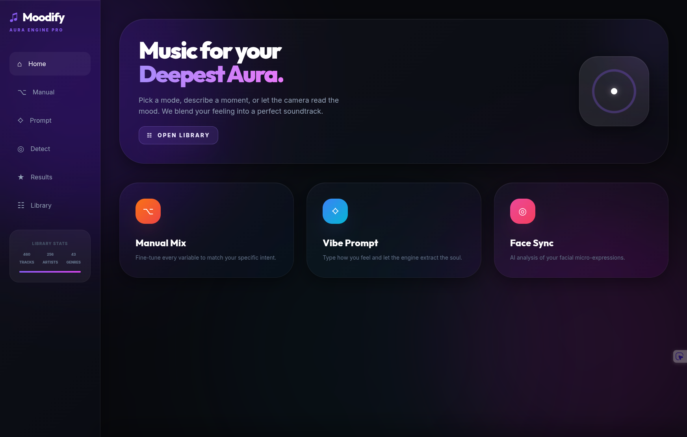
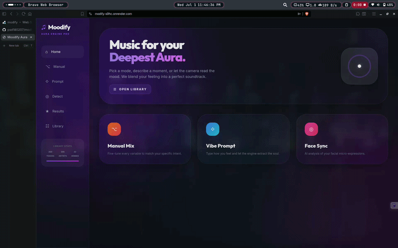

# Moodify Aura

Music for your deepest aura. A clean, professional, and unified scoring engine for contextual music recommendation.

## Features
- **Manual Mixing**: Fine-tune every variable to match your specific intent (energy, valence, speed, etc.).
- **Vibe Prompts**: Type how you feel and let the engine extract the soul using text analysis.
- **Face Sync**: AI analysis of your facial micro-expressions to recommend music matching your live mood.

## Tech Stack


## Architecture Summary
3 Input Modes (Manual, Vibe Prompt, Face Sync) ➡️ Unified Scoring Engine ➡️ Top 20 Matching Songs.
The application computes scores based on closeness, overlap, and penalties to match the perfect track from your library.

## Local Setup
1. Clone the repository.
2. Create and activate a virtual environment:
   ```bash
   python -m venv .venv
   source .venv/bin/activate  # On Windows: .venv\Scripts\activate
   ```
3. Install dependencies:
   ```bash
   pip install -r requirements.txt
   ```
4. Run the development server:
   ```bash
   uvicorn app.main:app --reload
   ```
5. Open `http://localhost:8000` in your browser.

## API Endpoints
- `POST /recommend/manual`: Provide manual attributes (emotion, energy, genre, etc.). Returns top matching songs.
  - **Example Request**: `{"emotion": "sad", "energy": 5, "valence": 5, "speed": 5, "danceability": 5, "genre": "(optional)", "time": "(optional)", "language": "(optional)", "era": "(optional)", "context": "(optional)", "activity": "(optional)", "artist": ""}`
- `POST /recommend/prompt`: Provide a raw string prompt. Returns top matching songs.
  - **Example Request**: `{"prompt": "A relaxing lofi beat for studying in the evening"}`
- `POST /recommend/face`: Captures emotion from the local webcam and returns top matching songs.
  - **Example Request**: `{"extra": "instrumental"}`
- `POST /recommend/face-browser`: Analyzes a base64 browser image for face emotion and returns top matching songs.
  - **Example Request**: `{"image": "data:image/jpeg;base64,...", "extra": ""}`

## Note on Face Sync
Face Sync requires webcam permissions. To perform emotion detection locally without external API calls, this project utilizes `OpenCV` and `DeepFace`. The engine will temporarily turn on your webcam to read your expression.

## Demo
website link : https://modify-s9hc.onrender.com

website interface : 

website demo : 
